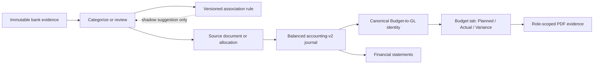

# YCM Accounting Intelligence and Native Budgets — Build Protocol

Status: active  
PocketPM plan: `HOA Accounting Intelligence and Native Budgets`  
PocketPM workstream: `Accounting Integrity, Rules, and Budgets`  
Approved authority: YCM Bank Rules and HOA Accounting Platform R2 plan  
Protected boundaries: no protected-balance writes, historical payment 1417F
changes, credential changes, or live-money tests

## 1. Service intent

Give board-managed and professionally managed associations trustworthy books
from immutable bank evidence through categorization, general ledger, budget,
Plan-vs-Actual, and export.

Target users:

- Board treasurers and authorized board members
- Property managers across multiple associations
- Property Manager Assistants within delegated association permissions
- Accountants and other authorized financial reviewers

Every record, rule, screen, export, notification, and direct request remains
association-scoped.

## 2. Journey review

Continuity requirements:

- Provider ingestion continues when automation or posting is disabled.
- Classification never creates a financial posting by itself.
- Stripe or another payment rail creates an owner receipt; a bank deposit only
  settles that existing identity.
- A trusted Plan-vs-Actual view requires canonical account/fund links and zero
  unresolved mappings.
- UI values and downloaded PDF values must match to the cent.

## 3. Findings

### GL integrity blocker

The current owner-ledger posting code correctly maps recurring dues to account
4000 and assessments to account 4200. The persisted source-leg uniqueness model
is not shape-aware: when a posting policy changes, the new leg can be appended
while the obsolete leg remains.

Read-only CHC aggregate evidence on 2026-07-24:

- 94 expected owner-ledger journals
- 93 persisted owner-ledger journals
- 80 exact journals
- 13 journals with an obsolete extra income leg
- 1 completely missing journal
- 13 unbalanced journals
- 1,923,208-cent corpus imbalance
- 33,000-cent Accounts Receivable drift

No owner, unit, payment, or source-row private data was inspected or recorded.

### Bank-rule gap

YCM has owner-deposit matching and learned descriptor aliases. It does not have
a general accounting categorization rule engine. Live CHC evidence showed bank
transactions but no durable general categories, accounting rules, or bank-to-
owner-ledger links.

### Budget-to-GL gap

Budget lines can omit canonical account links. A separate optional mapping table
and name/vendor matching can cause actuals to repeat or map to the wrong line.
The current variance query also needs an exact fiscal-period end boundary.

## 4. Locked product decisions

### Two-confirmation rule learning

1. First consistent manual categorization stores a training observation.
2. Second consistent categorization for the same association, normalized
   payee/descriptor, and direction creates a visible proposed rule.
3. Conflicting second choices do not create a rule and enter review.
4. Activation, deactivation, and edits create immutable versions with audit
   lineage.
5. Rules apply prospectively. Release 1 is shadow/suggestion mode.

### Native Budget-to-GL authority

- GL-first and budget-first setup converge on the same canonical association
  account and fund identity.
- Custom/imported lines remain visibly unresolved until mapped.
- Trusted outputs require zero unresolved mappings.
- Name and vendor proxy matching are not accounting authority.

### Budget experience

The Budget table is the single Plan-vs-Actual visual:

| Budget item | Planned | Actual | Variance | Variance % |
|---|---:|---:|---:|---:|

The table includes totals, association, fiscal year/version, filters, as-of
date, fund context, and mapping trust state. The PDF download represents the
current view. There is no separate Plan-vs-Actual tab.

## 5. Dependency-driven implementation

### R0 — GL integrity and control reconciliation

Deliver:

- Shape-aware runtime idempotency gate that refuses obsolete persisted legs
- Aggregate-only `audit` and `assert` modes
- Separately gated, transaction-safe derived-GL repair mode
- Advisory lock, rollback on failed post-repair assertion, and append-only audit
- Exact reconciliation of the 1,923,208-cent imbalance and 33,000-cent AR drift

Gate:

- Zero unbalanced owner-ledger journals
- Zero missing/unexpected legs
- Zero owner-subledger-to-GL AR drift
- Production repair requires its own change approval and pre-deploy snapshot

### R1 — Bank Rules shadow mode

Deliver:

- Immutable normalized bank transactions
- Versioned association rules and simulations
- Explanations, observation history, review queue, alerts, and kill switch
- Two-confirmation proposed-rule learning
- User rule workspace for review, activation, deactivation, and new versions

Gate:

- Zero cross-association access
- Deterministic simulations
- Conflicts, splits, owner allocations, novel/high-value items, and posting
  remain human-reviewed
- Safe retry and failure visibility

### R2 — Native Budget-to-GL foundation

Deliver:

- Canonical account/fund identity at budget-line creation
- Convergent GL-first and budget-first setup
- Compatibility migration from optional mappings
- Integer-cent planned values
- Explicit unresolved mapping state
- Exact fiscal-period start and end

Gate:

- Zero name/vendor proxy authority
- Zero cent drift
- Zero unresolved mappings for trusted output
- Existing API shapes remain compatible during rollout

### R3 — Inline Plan-vs-Actual and PDF

Depends on R0 and R2.

Deliver:

- Planned, Actual, Variance, and Variance % columns in the Budget table
- Totals, filters, as-of date, version, fund context, and trust state
- Role-scoped PDF matching the selected view

Gate:

- UI values derive from canonical GL account/fund identity
- UI and PDF match to the cent
- Direct download requests enforce the same association permissions as the page

### R4 — Continuity gate and CHC shadow pilot

Depends on R0–R3.

Verify board, Property Manager, delegated Property Manager Assistant, and
accountant journeys through bank evidence, categorization, GL, budget,
Plan-vs-Actual, statements, notifications, and downloads.

Gate:

- Zero tenant leaks, duplicate economic events, unbalanced journals, cent drift,
  unresolved trusted mappings, notification failures, stale/failed queues, or
  broken/mismatched downloads
- Any failure disables affected automation, preserves ingestion and evidence,
  triggers RCA, and reruns affected workflows and regressions

## 6. Execution rhythm and evidence

For every slice:

1. Start the linked PocketPM checkpoint and work item.
2. Implement one independently verifiable slice in an isolated worktree.
3. Run targeted unit/integration tests, typecheck, production build, and
   association-scope regressions.
4. Update live roadmap evidence with files, test results, and aggregate runtime
   proof.
5. Move the work item to review. Only PocketPM/William can approve or complete
   the item.

Current R0 evidence:

- 17 targeted tests pass.
- Typecheck passes.
- Production build passes.
- The new audit tool reproduced the live aggregate failure exactly in read-only
  mode.
- No production financial mutation has been run.
