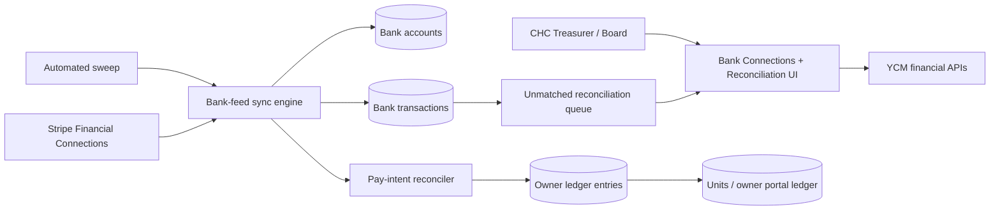
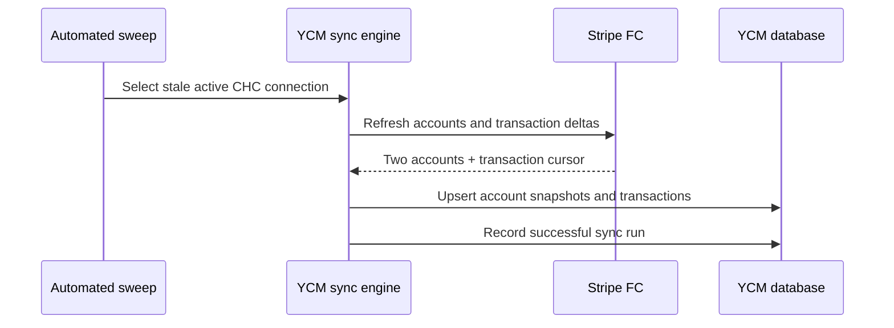
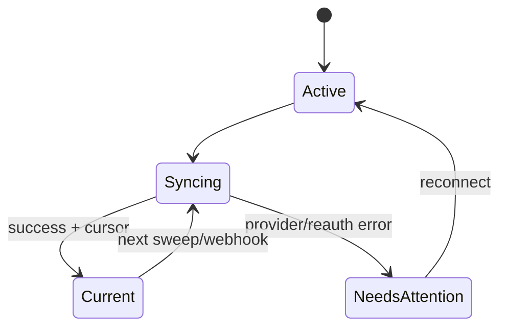
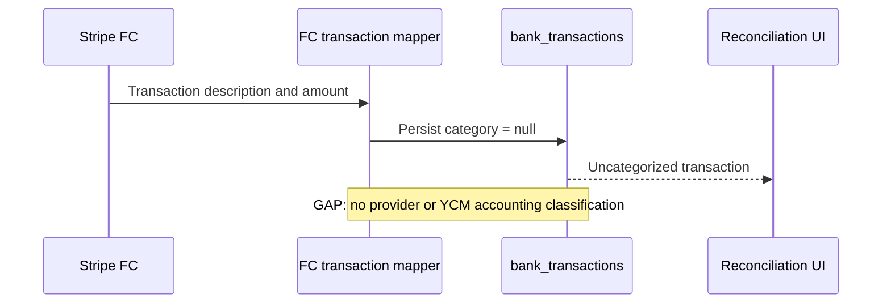
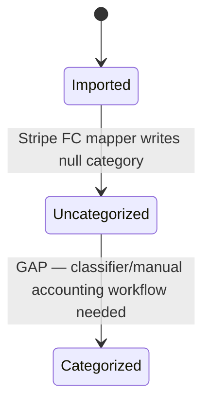
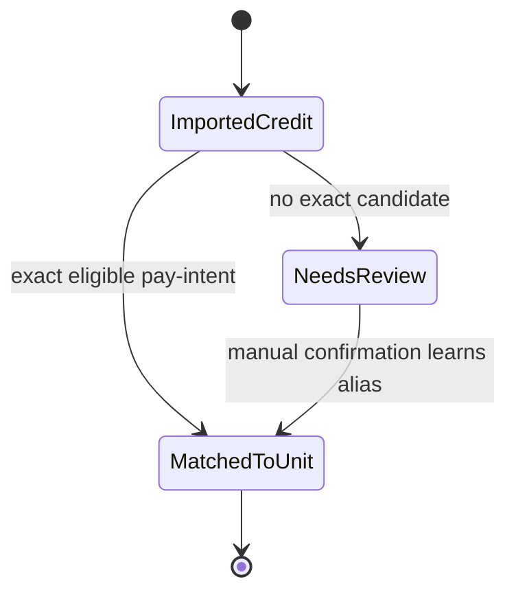
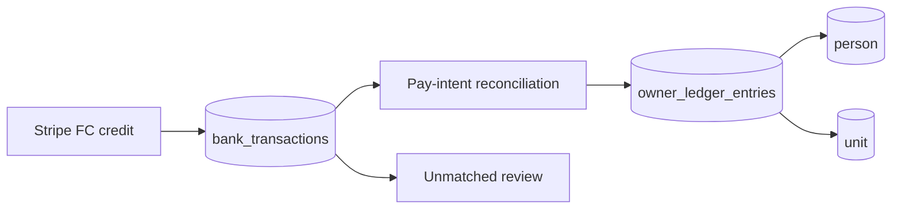

# CHC Bank Feed, Categorization, and Unit Assignment Audit

## Outcome

- Mode: Audit and diagnose (read-only production evidence; no financial data changed)
- Scope: Cherry Hill Court Condominiums association bank feed through transaction categorization and owner-unit assignment
- Environment: Production, Fly machine version 254
- Criticality: Critical — financial data and owner ledger attribution
- Audit coverage: 3/3 workflows mapped and evaluated
- Certification coverage: 1/3 verified live; 2/3 gaps
- Critical gaps: zero categorized bank transactions and zero bank transactions linked to owner-ledger/unit records
- Evidence as of: 2026-07-22T16:52:34Z

## Scope and authorities

| Item | Value |
|---|---|
| Objective | Determine whether CHC bank data is syncing, auto-categorizing, and assigning deposits to relevant units |
| Actors | CHC treasurer/board; automated bank-feed sweep |
| Included | Association bank connection, accounts, transactions, sync runs, reconciliation links, unit references, learned aliases |
| Excluded | Raw bank account numbers, balances, transaction descriptions, owner names, production mutations |
| Requirements authority | William's request and YCM finance continuity requirements |
| Code authority | `origin/main` at `fef7c75`; deployed Fly version 254 |
| Data authority | Aggregate-only production PostgreSQL queries scoped to CHC |
| Provider authority | Stripe Financial Connections production connection state |
| Deployment authority | Fly production machine/image status |

## Capability reconciliation

| Capability ID | Actor intent | UI entry | Backend path | Status | Notes |
|---|---|---|---|---|---|
| CAP-BANK-001 | Connect and continuously sync the association's bank feed | `/app/financial/bank-connections` | `runBankFeedSweep` → `bank-feed-sync.ts` → Stripe FC | verified-live | Active connection, two accounts, current successful sync |
| CAP-BANK-002 | Categorize imported bank transactions | Reconciliation/bank transaction views | Stripe FC transaction mapper → `bank_transactions.category` | gap | Stripe FC mapper intentionally writes `category: null`; production has 0/91 categorized |
| CAP-BANK-003 | Attribute incoming owner deposits to the correct owner and unit | Reconciliation review | sync reconciliation, auto-matcher, descriptor aliases, unit references | gap | Production has 0 bank-linked ledger rows, 70 unmatched credits, no aliases, no unit references |

### Backend-only capabilities

- The automated bank-feed sweep runs without a user opening the reconciliation page.
- A broader confidence-scored matcher and learned descriptor aliases exist in code, but the bank-feed sync path invokes the narrower pay-intent reconciler.

### UI-only capabilities

- None identified in this bounded audit.

## System context



## Workflow summary

| Workflow ID | Workflow | Risk | Status | Data | Process | Notifications | UX | Recovery | Evidence |
|---|---|---|---|---|---|---|---|---|---|
| WF-BANK-001 | Sync CHC bank balances and transactions | critical | verified-live | pass | pass | N/A | pass | pass | EV-BANK-001, EV-BANK-002 |
| WF-BANK-002 | Categorize imported transactions | critical | gap | fail | fail | N/A | fail | gap | EV-BANK-003, EV-BANK-004 |
| WF-BANK-003 | Assign incoming deposits to owners and units | critical | gap | fail | fail | N/A | fail | partial | EV-BANK-005, EV-BANK-006 |

## WF-BANK-001 — Sync CHC bank balances and transactions

- Actor/beneficiary: Automated sweep; CHC board and financial records
- Trigger/entry: Scheduled sweep, webhook, or manual sync
- Preconditions: Active association-scoped Stripe FC connection
- Terminal outcome: Account snapshot and transaction delta persisted with a successful sync-run record
- Invariants: CHC scope only; cursor persists; duplicate provider transactions upsert idempotently
- Status: `verified-live`





| Dimension | Result | Evidence | Gap/notes |
|---|---|---|---|
| Entry | pass | EV-BANK-001 | Scheduled production sweep is active |
| Identity/scope | pass | EV-BANK-002 | Connection and both accounts are association-scoped |
| Validation | pass | EV-BANK-002 | Active provider connection and cursor |
| Orchestration/state | pass | EV-BANK-001 | 1,340 successful runs; zero failed |
| Data/projection | pass | EV-BANK-002 | 91 transactions; balance snapshots present for both accounts |
| Async/idempotency | pass | Code: `bank-feed-sync.ts` | Provider transaction IDs upsert; per-connection advisory lock |
| Provider | pass | EV-BANK-001 | Stripe FC enabled and active |
| Notifications | not-applicable | No actor notification is required for a successful periodic sync | Failures surface through connection state and audit rows |
| User-visible outcome | pass | EV-BANK-002 | Synced accounts/transactions are available to financial views |
| Audit/operations | pass | EV-BANK-001 | Per-run audit rows and last-sync timestamp |
| Privacy/retention | pass | Audit query design | Evidence records aggregates only |

## WF-BANK-002 — Categorize imported transactions

- Actor/beneficiary: CHC treasurer and accounting reports
- Trigger/entry: Transaction import
- Expected terminal outcome: Each transaction receives a useful accounting category or is surfaced for categorization
- Observed outcome: 0 of 91 production transactions have a populated category
- Status: `gap`





| Dimension | Result | Evidence | Gap/notes |
|---|---|---|---|
| Entry | pass | EV-BANK-003 | Transactions enter the mapper |
| Identity/scope | pass | EV-BANK-003 | CHC-scoped records |
| Validation | pass | Code: `stripe-fc-provider.ts` | Currency, sign, date, and status normalized |
| Orchestration/state | fail | EV-BANK-004 | No categorization step after import |
| Data/projection | fail | EV-BANK-003 | `categorized=0` of 91 |
| Async/idempotency | pass | Code: `bank-feed-sync.ts` | Re-imports upsert safely |
| Provider | fail | EV-BANK-004 | FC mapper exposes no transaction category and writes null |
| Notifications | not-applicable | No categorization notification contract exists | Uncategorized work should be visible in reconciliation |
| User-visible outcome | fail | EV-BANK-003 | Treasurer cannot rely on automatic accounting categories |
| Audit/operations | pass | EV-BANK-001 | Sync is observable; category completion metric is not |
| Privacy/retention | pass | EV-BANK-003 | Aggregate inspection only |

## WF-BANK-003 — Assign incoming deposits to owners and units

- Actor/beneficiary: Owners, CHC treasurer, and owner ledgers
- Trigger/entry: Posted bank credit enters reconciliation
- Expected terminal outcome: High-confidence deposits link once to the correct owner-ledger row and unit; uncertain deposits remain in review
- Observed outcome: No bank transaction has been linked to an owner-ledger entry, person, or unit
- Status: `gap`

```mermaid
sequenceDiagram
    participant B as Posted bank credit
    participant S as Bank sync
    participant R as Narrow pay-intent reconciler
    participant L as Owner ledger
    participant Q as Manual review queue
    B->>S: Import credit
    S->>R: Reconcile CHC credits
    R->>L: Match only exact pay-intent amount/date candidates
    alt exact candidate exists
        L-->>R: Link bank transaction and settle
    else no exact candidate
        R->>Q: Leave unmatched
    end
    Note over L,Q: Production result: 0 linked; 70 posted credits unmatched
```





| Dimension | Result | Evidence | Gap/notes |
|---|---|---|---|
| Entry | pass | EV-BANK-005 | 70 incoming credits imported |
| Identity/scope | pass | EV-BANK-006 | Zero cross-association links |
| Validation | pass | Code: `plaid-reconciliation.ts` | Exact cents, three-day window, credit sign, association scope |
| Orchestration/state | fail | EV-BANK-006 | Sync invokes narrow pay-intent reconciliation, not the broader owner/unit matcher |
| Data/projection | fail | EV-BANK-005 | Zero bank-linked ledger/person/unit rows |
| Async/idempotency | pass | Code: `plaid-reconciliation.ts` | Consumed credit exclusion and atomic match write |
| Provider | pass | EV-BANK-001 | Credits arrive from active FC connection |
| Notifications | not-applicable | No owner notification should fire before confirmed attribution | Manual review visibility is the safe fallback |
| User-visible outcome | fail | EV-BANK-005 | Owner ledgers do not reflect deposits imported from the bank feed |
| Audit/operations | pass | EV-BANK-001 | Sync counts expose zero matches; unmatched queue exists |
| Privacy/retention | pass | EV-BANK-006 | Association scope and aggregate evidence |

## Diagnostics and RCA

| RCA ID | Workflow | Symptom | First divergence | Root cause | Repair boundary | Regression needed | Status |
|---|---|---|---|---|---|---|---|
| RCA-BANK-001 | WF-BANK-002 | 0/91 transactions categorized | FC transaction mapping | `mapFcTransaction` intentionally returns `category: null`; no subsequent YCM accounting classifier fills it | Add deterministic/manual categorization workflow with review and audit | Provider import → category suggestion/confirmation → reports | Proven |
| RCA-BANK-002 | WF-BANK-003 | 0 deposits linked to units | Post-import reconciliation | Automated sync calls the narrow pay-intent matcher; CHC has no learned aliases, no unit payment references, unit-centric mode off, and no exact matches | Route safe candidates through the governed broader matcher; keep uncertain rows manual | Exact ref, owner roster, alias, duplicate, wrong-association, ambiguous and no-match cases | Proven |

## Residual risks, gates, and watchlist

| Item | Type | Impact | Exact action | Owner |
|---|---|---|---|---|
| Latest imported transaction is dated June 29 although sync is current | Watchlist | A current connection does not prove the provider has returned every July transaction | Compare against a redacted July bank statement/provider dashboard before historical catch-up is certified | YCM finance operator |
| No unit payment references | Gap | Exact-reference auto-attribution cannot operate | Generate stable per-unit references, enable by association after validation, and expose remittance instructions | YCM product |
| No learned descriptor aliases | Gap | Repeating deposits cannot benefit from prior human confirmation | Complete first manual confirmations through the audited reconciliation UI | CHC treasurer |
| Existing unmatched credits | Data reconciliation | 70 posted credits remain outside owner-ledger attribution | Produce a read-only candidate packet, then review before any ledger writes | CHC treasurer + YCM |

## Evidence index

| Evidence ID | Layer | Claim | Locator | Environment/release | Observed |
|---|---|---|---|---|---|
| EV-BANK-001 | live/data | CHC has one active Stripe FC connection; 1,340 successful sync runs, zero failures; latest success current | Aggregate production queries over `bank_connections` and `bank_feed_sync_runs` | Production Fly v254 | 2026-07-22T16:52:34Z |
| EV-BANK-002 | data | Two association-scoped bank accounts have balance snapshots; 91 transactions imported | Aggregate production queries over `bank_accounts` and `bank_transactions` | Production Fly v254 | 2026-07-22T16:52:34Z |
| EV-BANK-003 | data | Zero of 91 CHC bank transactions have a populated category | Aggregate production query over `bank_transactions.category` | Production Fly v254 | 2026-07-22T16:52:34Z |
| EV-BANK-004 | code | Stripe FC transaction mapping writes `category: null` | `server/services/bank-feed/stripe-fc-provider.ts`, `mapFcTransaction` | `origin/main` fef7c75 | 2026-07-22 |
| EV-BANK-005 | data | Zero bank-linked owner-ledger rows; zero linked units/persons; 70 posted credits unmatched | Aggregate production queries over `owner_ledger_entries` and `bank_transactions` | Production Fly v254 | 2026-07-22T16:52:34Z |
| EV-BANK-006 | code/data | Unit-centric mode is off; 0/18 units have payment references; zero aliases; zero cross-association links | Runtime flags plus aggregate production queries; `bank-feed-sync.ts` and `plaid-reconciliation.ts` | Production Fly v254 / `origin/main` fef7c75 | 2026-07-22T16:52:34Z |
| EV-BANK-TEST-001 | test | Bank sync, Stripe FC mapping/rendering, narrow reconciliation, and broader auto-matcher regression suites pass | Focused Vitest run: 5 files, 79 tests | Local checkout of production-relevant code | 2026-07-22T17:01:30Z |

## Completion-gate result

- [x] Actor and capability inventories reconcile.
- [x] Every workflow has a trace, diagrams, status, and evidence.
- [x] Every applicable continuity dimension is evaluated.
- [x] Every failure has an RCA or bounded diagnostic gap.
- [x] Critical postconditions use authoritative production aggregates.
- [x] No notification was incorrectly required before confirmed financial attribution.
- [x] Manifest validator and focused 79-test regression gate pass.
- [ ] Repair and regression evidence — outside this read-only audit request.
- [ ] Workflow certification — blocked by the two proven gaps above.
