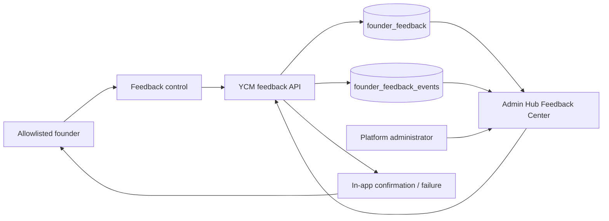
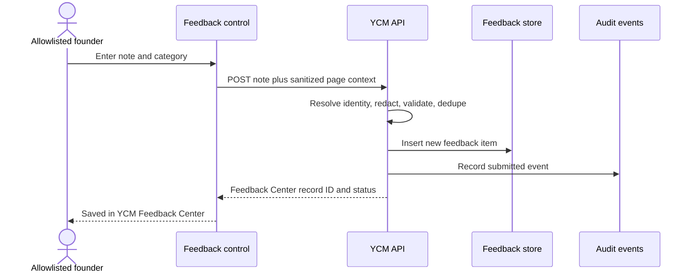
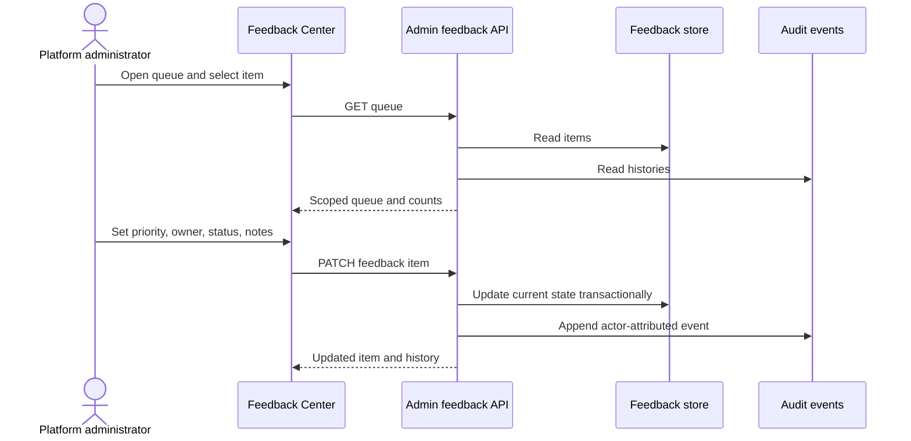
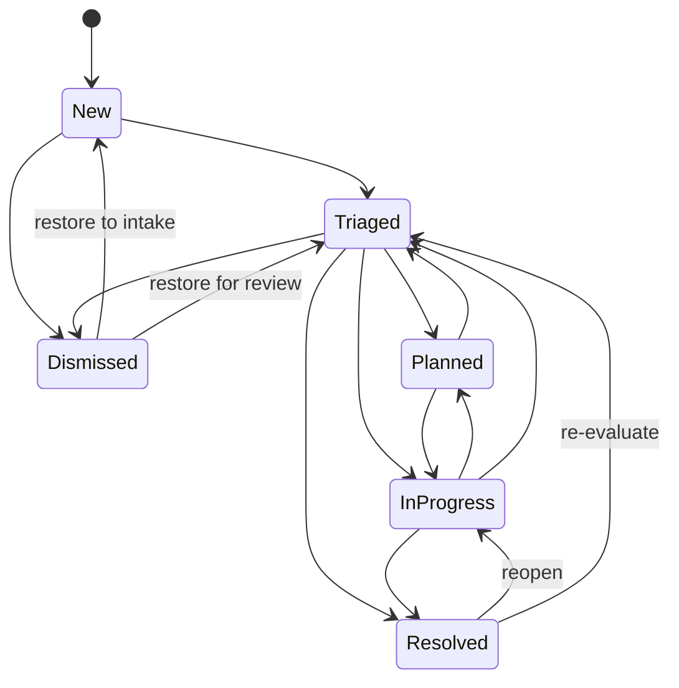

# First-party Feedback Center workflow audit

## Outcome

- Mode: repair-and-certify
- Scope: William-only contextual feedback on YCM admin, owner-portal, and public authenticated surfaces through internal triage and resolution
- Environments: local reviewed branch; production deployment not yet claimed
- Criticality: high (private contextual data and platform-administration authority)
- Audit coverage: 3/3 workflows mapped and evaluated
- Certification coverage: 0/3 live-certified; 3/3 verified in test/build
- Critical gaps: none in the reviewed implementation
- Gate: signed-in staging and production smoke after migration/deploy review
- Evidence as of: 2026-07-22T11:34:00Z

## Scope and authorities

| Item | Value |
|---|---|
| Objective | Replace GitHub issue mirroring with a YCM-owned feedback lifecycle |
| Actors | Allowlisted founder account; YCM platform administrator |
| Included | Intake, dedupe, existing-backlog import, queue, triage, assignment, notes, resolution, reopen, audit history, in-app confirmation |
| Excluded | Customer-wide support intake, email/SMS delivery, attachments, production deployment |
| Requirements authority | William direction in this task; PocketPM task `a6d5663f-aaec-4342-aad8-3f7efa59994d` |
| Code authority | `codex/ycm-first-party-feedback-center-2026-07-22` |
| Data authority | `founder_feedback` + append-only `founder_feedback_events` |
| Provider authority | Not applicable; no external issue provider in the operating path |
| Deployment authority | YCM protected deploy workflow |

## Capability reconciliation

| Capability ID | Actor intent | UI entry | Backend path | Status | Notes |
|---|---|---|---|---|---|
| CAP-FB-01 | Send contextual feedback | Floating Feedback controls | `POST /api/founder-feedback` | verified-test | Server allowlist, redaction, sanitized route, ten-minute dedupe |
| CAP-FB-02 | Review and own feedback | `/app/admin/feedback` | `GET/PATCH /api/admin/founder-feedback` | verified-test | Platform-admin only |
| CAP-FB-03 | Resolve or reopen feedback | Feedback Center lifecycle controls | `PATCH /api/admin/founder-feedback/:id` | verified-test | Server-enforced transition map + audit event |

Backend-only capabilities: legacy GitHub replay/cleanup endpoints remain as explicit HTTP 410 tombstones so automation cannot silently call a retired provider path.

UI-only capabilities: none.

## System context

## WF-FB-01 — Capture contextual feedback

Invariants: only the two server-allowlisted identities can submit; query strings/fragments and recognizable credentials are never retained; identical submissions in a ten-minute bucket return the existing item; no external provider is required for success.

## WF-FB-02 — Triage and assign

Invariants: APIs fail closed to platform administrators; internal notes are never returned to portal/public callers; each change records actor, time, prior state, next state, and detail.

## WF-FB-03 — Resolve and reopen

The server rejects unapproved jumps with HTTP 409. Resolution time is set on resolution/dismissal and cleared when an item is reopened. The append-only event log preserves the earlier terminal decision.

## Continuity result

| Workflow | Entry | Identity/scope | Validation | State | Data | Notifications | UX | Audit/recovery | Status |
|---|---|---|---|---|---|---|---|---|---|
| WF-FB-01 | pass | pass | pass | pass | pass | pass | pass | pass | verified-test |
| WF-FB-02 | pass | pass | pass | pass | pass | pass | pass | pass | verified-test |
| WF-FB-03 | pass | pass | pass | pass | pass | pass | pass | pass | verified-test |

## Repairs and validation

| Change | Invariant restored | Evidence |
|---|---|---|
| Retired GitHub calls from submission path | Feedback success has no credential/provider dependency | Route trace + build |
| Added first-party lifecycle columns and events | Queue state and history are internally authoritative; existing records receive an idempotent migration event | Migration/schema trace |
| Added platform-admin Feedback Center | Feedback is discoverable and operable inside YCM | Production bundle includes lazy page chunk |
| Added transition guard | Invalid/out-of-order transitions fail safely | 3 lifecycle tests |
| Updated confirmation copy | UI no longer claims GitHub routing | Component regression test |

Validation: TypeScript check passed; production build passed; 15 targeted feedback tests passed. The manifest validator is the completeness gate for this package.

## Residual gate

Run the additive migration in isolated staging, sign in as the platform administrator, submit one synthetic note from a test identity, move it through triage → in progress → resolved, verify the event history and wrong-role denial, then deploy through the protected YCM release workflow. Until that occurs, this package is verified-test—not verified-live.
