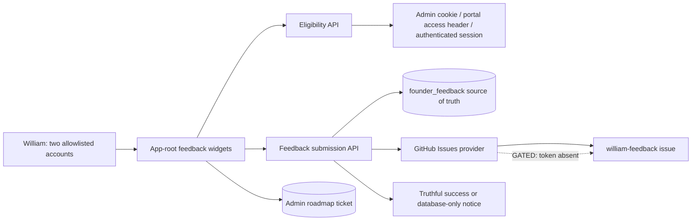
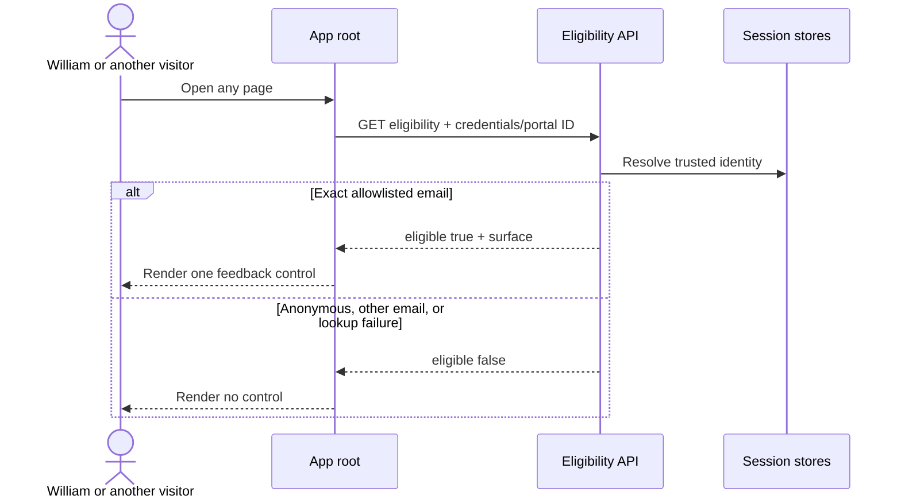
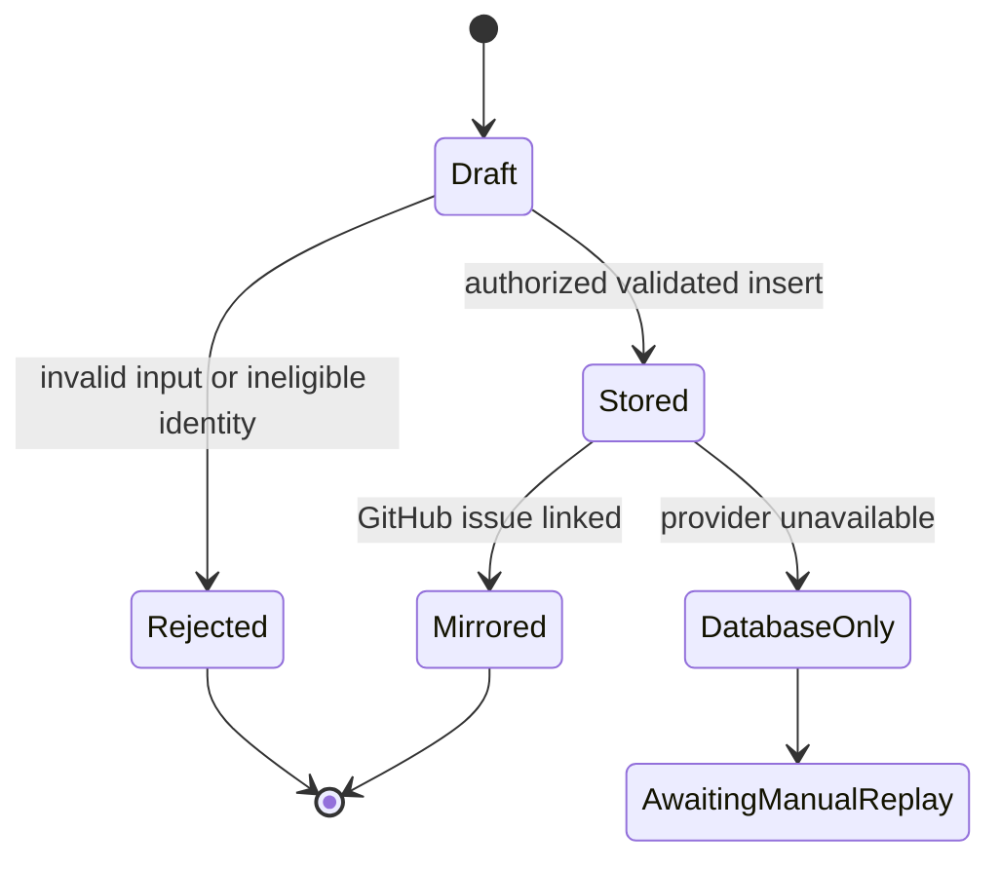

# William-only contextual feedback workflow audit

## Outcome

- Mode: repair and certify
- Scope: William's allowlisted Admin and Owner Portal/public-page feedback journeys
- Environments: production (`yourcondomanager`, machine version 250) and local automated tests at `6751c36`
- Criticality: high (identity, privacy, external communication)
- Audit coverage: 100% (3/3 workflows mapped and evaluated)
- Certification coverage: 0% (production GitHub delivery is credential-gated)
- Critical gaps: the deployed app has neither `GITHUB_TOKEN` nor `GH_TOKEN`; GitHub issue creation cannot execute
- Repairs: database-only submissions now report a truthful user-visible status; mirror failures emit a redacted server warning; Admin feedback reports secondary-mirror failure without losing its durable roadmap ticket; query strings/fragments are stripped before feedback persistence, logs, or GitHub mirroring
- Gate owner/action: William supplies a least-privilege YCM Issues token through PocketPM Human Task `69eb8000-9d5b-4033-b30c-3e9b2e2e590e`; GM deploys it and performs one synthetic end-to-end proof
- Evidence as of: 2026-07-21T03:30:32Z

## Scope and authorities

| Item | Value |
|---|---|
| Objective | Prove that William alone can submit page-aware feedback and that it reaches durable YCM storage plus a GitHub issue |
| Actors | William via `chcmgmt18@gmail.com` (Admin/Board) and `yourcondomanagement@gmail.com` (Owner/general session) |
| Included | Eligibility, widget mounting, validation, route/context capture, DB persistence, GitHub issue mirror, confirmations and failure handling |
| Excluded | Other resident/manager feedback systems; production mutation before a safe token exists |
| Requirements authority | Durable YCM task `t-1784315826-80833-11786` and PocketPM task `ecb4058c-e35f-4200-9c3a-1bb9331745e1` |
| Code authority | `williamruiz1/YourCondoManager` at `6751c36` plus this audit branch |
| Data authority | Production PostgreSQL `founder_feedback` |
| Provider authority | GitHub Issues REST API for `williamruiz1/YourCondoManager` |
| Deployment authority | Fly app `yourcondomanager`, machine version 250 |

## Capability reconciliation

| Capability ID | Actor intent | UI entry | Backend path | Status | Notes |
|---|---|---|---|---|---|
| CAP-001 | See feedback control only when eligible | App-root floating widget | `GET /api/founder-feedback/eligible` | verified-test | Anonymous production call fails closed; both exact emails and near-match rejection pass tests |
| CAP-002 | Submit simple page feedback from Owner Portal/public pages | `FounderFeedbackWidget` | `POST /api/founder-feedback` → PostgreSQL → GitHub | gated | DB sink is live; provider token is absent |
| CAP-003 | Submit inspected-element feedback from Admin | `AdminContextualFeedbackWidget` | Admin roadmap ticket + feedback POST → PostgreSQL → GitHub | gated | Roadmap ticket remains durable if secondary mirror fails; provider token is absent |

Backend-only capabilities: none in scope.

UI-only capabilities: none in scope.

## System context



## Workflow summary

| Workflow ID | Workflow | Risk | Status | Data | Process | Notifications | UX | Recovery | Evidence |
|---|---|---|---|---|---|---|---|---|---|
| WF-001 | Resolve eligibility | high | verified-test | pass | pass | N/A | pass | pass | EV-001, EV-002, EV-004 |
| WF-002 | Submit Owner/public feedback | high | gated | pass | gated | pass after repair | pass after repair | manual replay required | EV-001, EV-003, EV-005, EV-006 |
| WF-003 | Submit Admin contextual feedback | high | gated | pass | gated | pass after repair | pass after repair | Admin roadmap ticket preserved | EV-001, EV-003, EV-005, EV-006 |

## Workflow details

### WF-001 — Resolve William-only eligibility

- Trigger/entry: App root loads on any route.
- Preconditions: an Admin cookie, `x-portal-access-id`, or general authenticated session may be present.
- Terminal outcome: exact allowlisted identity receives `eligible:true`; every other identity receives no feedback UI.
- Invariants: client never supplies the deciding email; server checks the same exact allowlist on eligibility and write.
- Alternate/failure path: identity-resolution failure returns `{eligible:false}` without leaking details.



Continuity: entry `pass`; identity/scope `pass`; validation `pass`; orchestration `pass`; data `not-applicable`; async `not-applicable`; provider `not-applicable`; notifications `not-applicable`; user outcome `pass`; operations `pass`; privacy `pass`. Status: `verified-test` because the eligible production session was not mutated/reopened in this bounded audit.

### WF-002 — Submit Owner Portal or public-page feedback

- Trigger/entry: eligible William opens Feedback, enters a note and optional severity, then selects Send.
- Data: route, page title, viewport and user agent are captured; server-resolved email/surface/identity and release are persisted with the note.
- Validation: note is required and capped at 4,000 characters; route is required and capped at 500; dimensions must be positive integers.
- Terminal outcomes: GitHub-filed success, database-only durable fallback, validation rejection, authorization rejection, or server failure.
- Recovery: the DB row preserves an unmirrored submission; replay is currently an operator action after the token is configured.

```mermaid
sequenceDiagram
    actor W as William
    participant UI as Owner/public widget
    participant API as Feedback API
    participant DB as PostgreSQL
    participant GH as GitHub Issues
    W->>UI: Enter note and Send
    UI->>API: Note + page context + portal/session credentials
    API->>API: Resolve identity, exact allowlist, validate payload
    API->>DB: Insert founder_feedback row
    DB-->>API: Stable feedback ID
    API->>GH: Create labeled issue
    alt Provider configured and accepts
        GH-->>API: Issue URL and number
        API->>DB: Store issue linkage
        API-->>UI: dbOnly false
        UI-->>W: Routed to build team
    else Token absent or provider fails
        API-->>UI: dbOnly true
        UI-->>W: Saved to YCM; GitHub unavailable
        API-->>API: Redacted warning with feedback ID
    end
```



Continuity: entry `pass`; identity/scope `pass`; validation `pass`; orchestration `gated`; data/projection `pass`; async/idempotency `not-applicable`; provider `gated`; notifications `pass after repair`; user outcome `pass after repair`; operations `pass after repair`; privacy/retention `pass`. Status: `gated` on production GitHub credentials and signed-in live proof.

### WF-003 — Submit Admin inspected-element feedback

- Trigger/entry: eligible William selects a page element, describes a bug/enhancement and submits.
- Authoritative primary outcome: Admin roadmap task is created first.
- Secondary outcome: the same note and page context are persisted to `founder_feedback` and mirrored to GitHub.
- Failure isolation: secondary failure never destroys or falsely fails the primary roadmap ticket; repaired to tell William when the mirror is unavailable or fails.

```mermaid
sequenceDiagram
    actor W as William
    participant UI as Admin contextual widget
    participant ROAD as Admin roadmap API
    participant FB as Feedback API
    participant DB as PostgreSQL
    participant GH as GitHub Issues
    W->>UI: Inspect element and submit
    UI->>ROAD: Context + screenshot + description
    ROAD-->>UI: Durable roadmap task
    UI->>FB: Mirrored note + page context
    FB->>DB: Insert founder_feedback
    FB->>GH: Create labeled issue
    alt GitHub succeeds
        GH-->>FB: Issue link
        FB->>DB: Store link
    else GitHub unavailable
        FB-->>UI: dbOnly true or request failure
        UI-->>W: Roadmap safe; mirror unavailable/failed
    end
```

Continuity: entry `pass`; identity/scope `pass`; validation `pass`; orchestration `gated`; data/projection `pass`; async/idempotency `not-applicable`; provider `gated`; notifications `pass after repair`; user outcome `pass after repair`; operations `pass after repair`; privacy/retention `pass`. Status: `gated`.

## Diagnostics and RCA

| RCA ID | Workflow | Symptom | First divergence | Root cause | Repair | Regression | Status |
|---|---|---|---|---|---|---|---|
| RCA-001 | WF-002, WF-003 | Production cannot create GitHub issues | Provider credential lookup | Neither accepted token name is deployed to Fly | PocketPM credential task; deploy and synthetic proof after receipt | Existing provider helper tests + final live proof pending | gated |
| RCA-002 | WF-002 | Database-only fallback claimed routing success | User-visible projection | Client ignored `dbOnly` response | Distinct database-only toast | `founder-feedback-widget.test.ts` | repaired locally |
| RCA-003 | WF-003 | Secondary mirror failures were silent | Notification/operations boundary | Promise rejection intentionally swallowed | Warning toast while preserving primary roadmap success; redacted server warning | TypeScript + focused suites | repaired locally |
| RCA-004 | WF-002, WF-003 | Full client route could persist sensitive URL parameters | Data/privacy boundary | Route context was stored verbatim | Strip query strings and fragments server-side before storage, logs and GitHub | `sanitizeFounderFeedbackRoute` tests | repaired locally |

## Evidence index

| Evidence ID | Layer | Claim | Locator | Environment/release | Observed |
|---|---|---|---|---|---|
| EV-001 | code | Exact allowlist, identity resolution, validation, persistence and GitHub mirror paths exist | `server/founder-feedback.ts`; `server/routes.ts` | `6751c36` | 2026-07-21T03:27Z |
| EV-002 | test | Exact-email allow, near-match denial, route redaction and issue context builders pass | `npm test -- --run server/__tests__/founder-feedback.test.ts tests/auth-surface-parity.test.ts server/routes/__tests__/route-inventory-tenant-scope.test.ts` — 21/21 | local | 2026-07-21T03:35Z |
| EV-003 | data | `founder_feedback` exists with 0 total, 0 mirrored and 0 database-only rows | redacted read-only production aggregate query | production machine v250 | 2026-07-21T03:28Z |
| EV-004 | live | Anonymous production eligibility fails closed; app health and migration journal are healthy | `GET /api/founder-feedback/eligible`; `GET /api/health` | production machine v250 | 2026-07-21T03:30:32Z |
| EV-005 | provider | No `GITHUB_TOKEN` or `GH_TOKEN` secret name is deployed and no labeled issue exists | `flyctl secrets list`; GitHub REST label query | production | 2026-07-21T03:30Z |
| EV-006 | test | Truthful database-only and routed-success messages are regression-covered | `npm run test:client -- --run client/src/components/founder-feedback-widget.test.ts` — 2/2 | local audit branch | 2026-07-21T03:33Z |

## Residual risks, gates, and watchlist

| Item | Type | Impact | Exact unblock/action | Owner | Due/trigger |
|---|---|---|---|---|---|
| GitHub token absent | credential gate | No submission can create its required GitHub issue | Complete PocketPM Human Task `69eb8000-9d5b-4033-b30c-3e9b2e2e590e` | William | before certification |
| Signed-in live submission not run | safe-action gate | Actor journey and authoritative dual postcondition remain unproven live | After token deploy, submit one synthetic note and verify DB row + issue link | YCM GM | immediately after token |
| Existing outage rows require manual replay | operations watchlist | A future provider outage can leave DB-only records | Query `github_issue_number IS NULL`, file deliberately, then persist linkage | YCM GM | after any mirror warning |

## Completion-gate result

- [x] Actor and capability inventories reconcile.
- [x] Every workflow has a trace, required diagrams, status and evidence.
- [x] Every applicable continuity dimension is evaluated.
- [x] Every failure has an RCA or bounded gate.
- [x] Implemented repairs have regression coverage.
- [ ] Critical live postconditions are authoritative (credential-gated).
- [ ] GitHub delivery is proven (credential-gated).
- [x] Manifest validator passes (3 workflows; 2 gated, 1 verified-test; 0 warnings).
- [x] Gates and risks have exact owners/actions.
- [ ] Published interaction was live-tested after deployment.

The audit is complete, but the workflows are not certified. Certification is blocked only by the named production credential and the resulting signed-in synthetic proof.
