# YCM Owner Payment-to-Accounting Continuity Audit

## Outcome

- Mode: repair-and-certify
- Scope: successful owner payments, duplicate/replay handling, derived GL projection failure recovery, and payment reversal projection
- Environment(s): production read-only RCA; local isolated regression harness
- Criticality: critical
- Audit coverage: 4 of 4 workflows mapped; 44 of 44 continuity dimensions evaluated
- Certification coverage: 0 of 4 pending staged and production validation
- Critical gaps: none in the repaired code path; deployment and live postconditions remain gated
- Gates: protected balances, historical payment 1417F, credentials, and live Stripe payments remain untouched
- Evidence as of: 2026-07-24T17:33:12Z

## Scope and authorities

| Item | Value |
|---|---|
| Objective | Ensure every settled owner payment that reaches YCM's owner ledger reaches the derived accounting journal and statements exactly once, with detection and recovery if projection fails. |
| Actors | Owner, association financial operator, YCM payment automation, Stripe |
| Included | Signed success events, canonical payment identity, owner-ledger write, GL projection, owner receipt fallback, duplicate/replay, critical alert, five-minute recovery sweep, refund/chargeback accounting projection |
| Excluded | New live-money tests, protected balance changes, edits to payment 1417F, credentials, financial-statement authority cutover, and refund/dispute policy changes |
| Requirements authority | Approved YCM Continuity Correction and Bank Rules/HOA Accounting R2 mandates |
| Code authority | YourCondoManager branch `fix/ycm-gl-canonical-shape-repair`, base `05ae79afcfa98d14f4a6cb8a7986b9c2db855e83`, plus the uncommitted repair represented by this report |
| Data authority | Production owner ledger, payment transactions, webhooks, and derived GL inspected read-only with aggregate evidence |
| Provider authority | Stripe signed webhook event state; no new provider action performed |
| Deployment authority | Existing staged-release and protected production release gates |

## Capability reconciliation

| Capability ID | Actor intent | UI entry | Backend path | Status | Notes |
|---|---|---|---|---|---|
| CAP-PAY-001 | Owner pays and sees the payment reflected | Owner Portal payment controls and receipt/history views | Signed webhooks → canonical payment writer → owner ledger → GL → statements | Mapped | Live revalidation gated until deploy |
| CAP-PAY-002 | Stripe/YCM safely handles duplicate delivery | Provider webhook delivery/retry | Payment identity unique key plus exact-event replay guard | Mapped | Replay also heals a missed projection |
| CAP-PAY-003 | Financial operator can detect and recover a journal gap | Financial Alerts and platform health details | Runtime sync alert plus five-minute continuity sweep | Mapped | Alert contains no private payment details |
| CAP-PAY-004 | Returned money reverses the ledger and accounting presentation | Stripe refund/dispute events | Idempotent reversal row → derived GL projection | Mapped | Broader refund/dispute policy and messaging excluded |

### Backend-only capabilities

- The continuity sweep has no end-user button; it is a recovery control that runs with the existing automation cycle.

### UI-only capabilities

- None found in scope.

## System context

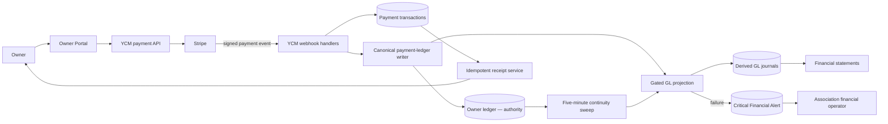

## Workflow summary

| Workflow ID | Workflow | Risk | Status | Data | Process | Notifications | UX | Recovery | Evidence |
|---|---|---|---|---|---|---|---|---|---|
| WF-PAY-001 | Settled payment reaches ledger, GL, statements, and receipt | Critical | Gated | Pass in tests; production repair pending | Pass in tests | Receipt wiring passes; provider delivery gated | Production display gated | Sweep backstop | EV-PAY-001–004 |
| WF-PAY-002 | Duplicate/replayed payment stays exactly once and heals projection | Critical | Gated | Pass in tests | Pass in tests | Not applicable | Production display gated | Replay + sweep | EV-PAY-005–006 |
| WF-PAY-003 | Projection failure alerts, retries, and resolves | Critical | Gated | Pass in tests | Pass in tests | In-app critical alert passes; live visibility gated | Production view gated | Five-minute retry | EV-PAY-007–010 |
| WF-PAY-004 | Refund/chargeback reversal reaches accounting | Critical | Gated | Pass in tests | Pass in tests | Not applicable to projection subflow | Production display gated | Replay + sweep | EV-PAY-011–012 |

## Workflow details

### WF-PAY-001 — Settled owner payment reaches accounting

- Actor/beneficiary: owner and association financial operator
- Trigger/entry: Stripe sends a signed success event after an owner payment settles.
- Preconditions: the event is authentic and fresh; association, unit, person, and canonical payment identity resolve within the same association; the association is in the GL cohort.
- Terminal outcome: one owner-ledger credit exists, one balanced cash/AR journal exists, statements derive from it, the transaction is succeeded, and the owner receipt is available/sent once.
- Invariants: no cross-association reference; no duplicate owner credit; journal debits equal credits; GL AR equals the owner subledger; receipt is idempotent; payment success is not erased by a non-authoritative GL failure.
- Systems: Owner Portal, YCM payment routes, Stripe, payment transactions, owner ledger, derived GL, statement service, receipt service.
- Data reads/writes: signed provider event; payment transaction status; immutable owner-ledger payment row; derived two-leg journal; receipt sent marker.
- Async/provider: Stripe webhook and receipt provider.
- Notifications: owner receipt; platform Connect and association webhook paths converge on the same idempotent receipt service.
- Observability: payment identity logs, GL sync result, critical financial alert, aggregate health count, sweep counters.
- Alternate/failure/recovery paths: delayed association webhook can be completed by platform Connect; a projection failure preserves payment truth, raises an alert, and retries.
- Status and rationale: `gated`; code and isolated regression pass, but the repaired commit is not yet staged/deployed and no new live payment is authorized.

#### Sequence

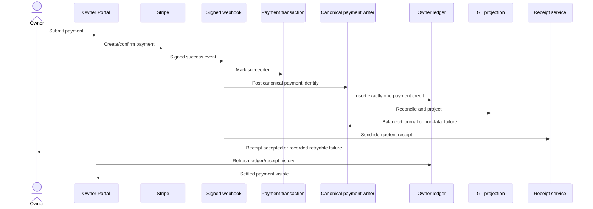

#### Lifecycle

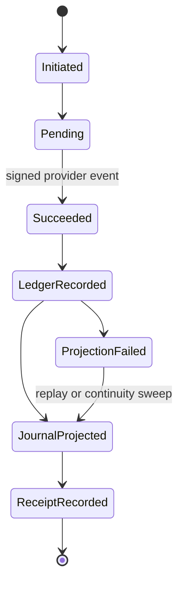

#### Data lineage

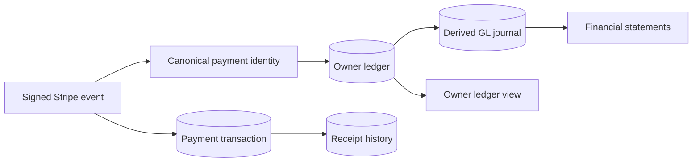

#### Continuity matrix

| Dimension | Result | Evidence | Gap/notes |
|---|---|---|---|
| Entry | Pass | EV-PAY-003 | Signed webhook routes exist. |
| Identity/scope | Pass | EV-PAY-002 | Association-scoped canonical identity. |
| Validation | Pass | EV-PAY-003 | Signature, timestamp, and metadata guards. |
| Orchestration/state | Pass | EV-PAY-001 | Canonical writer owns projection. |
| Data/projection | Pass | EV-PAY-001, EV-PAY-004 | Balanced journal mapping and regression pass. |
| Async/idempotency | Pass | EV-PAY-002 | Provider replay cannot duplicate credit. |
| Provider | Pass | EV-PAY-003 | Provider contract covered synthetically; no live event created. |
| Notifications | Pass | EV-PAY-003 | Both success routes call the idempotent receipt service. |
| User-visible outcome | Gated | EV-PAY-004 | Live portal/statement validation waits on deploy. |
| Audit/operations | Pass | EV-PAY-001 | Projection outcome, alerts, and sweep counters exist. |
| Privacy/retention | Pass | EV-PAY-009 | Alert excludes payment/private payloads. |

### WF-PAY-002 — Duplicate or replayed payment heals without duplication

- Actor/beneficiary: Stripe/YCM automation; owner is protected from duplicate credit.
- Trigger/entry: duplicate provider event, cross-path event for the same payment identity, or manual provider replay.
- Preconditions: an authoritative owner-ledger payment row already exists.
- Terminal outcome: owner ledger still contains one economic payment; the idempotent GL projection is re-run and may complete a previously missing journal.
- Invariants: uniqueness is association plus canonical payment identity; exact charge replay stays a no-op for owner ledger; projection replay cannot insert duplicate journal legs.
- Status and rationale: `gated` until deployed and production aggregate duplicate/drift checks pass.

#### Sequence

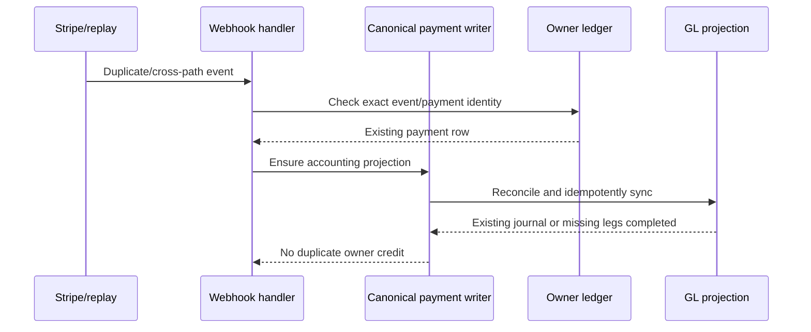

#### Lifecycle

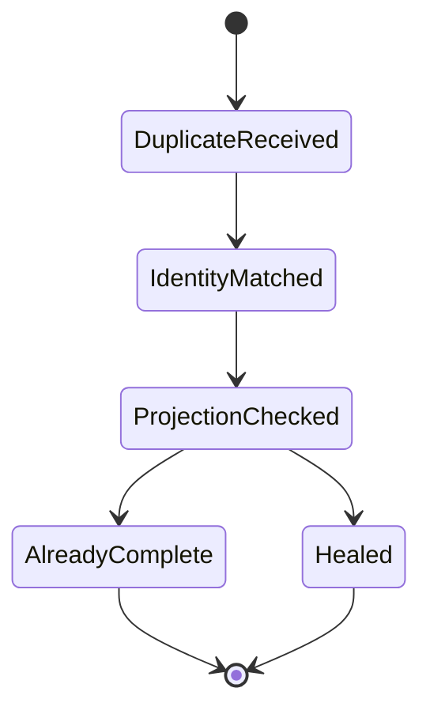

#### Data lineage

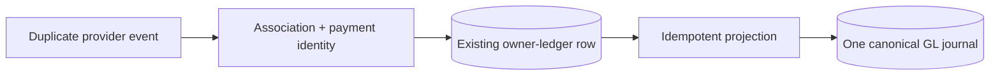

#### Continuity matrix

| Dimension | Result | Evidence | Gap/notes |
|---|---|---|---|
| Entry | Pass | EV-PAY-005 | Exact and cross-path replay tests. |
| Identity/scope | Pass | EV-PAY-005 | Per-association identity isolation. |
| Validation | Pass | EV-PAY-003 | Provider event validation is unchanged. |
| Orchestration/state | Pass | EV-PAY-005 | Replay calls projection. |
| Data/projection | Pass | EV-PAY-005 | One credit, one journal shape. |
| Async/idempotency | Pass | EV-PAY-005 | Duplicate and concurrent scenarios pass. |
| Provider | Pass | EV-PAY-003 | Signed event contract covered synthetically. |
| Notifications | Not applicable | EV-PAY-006 | Replay intentionally creates no second receipt. |
| User-visible outcome | Gated | EV-PAY-004 | Live ledger/statement display waits on deploy. |
| Audit/operations | Pass | EV-PAY-005 | Source and identity are logged without payment payload. |
| Privacy/retention | Pass | EV-PAY-009 | No private data added to recovery alert. |

### WF-PAY-003 — Projection failure alerts and self-recovers

- Actor/beneficiary: association financial operator and YCM operations.
- Trigger/entry: reconcile gate failure, canonical-shape failure, database error, or process termination between owner-ledger commit and GL completion.
- Preconditions: owner-ledger payment truth exists; association is in the GL cohort.
- Terminal outcome: payment remains valid; a critical association-scoped Financial Alert and aggregate health warning exist; a five-minute sweep retries; successful reconciliation dismisses the alert.
- Invariants: no private owner/payment details in alerts; one deterministic alert per association; disabled associations remain untouched; one failing association does not stop another.
- Status and rationale: `gated` until the alert, health warning, retry, and resolution are observed in the deployed environment.

#### Sequence

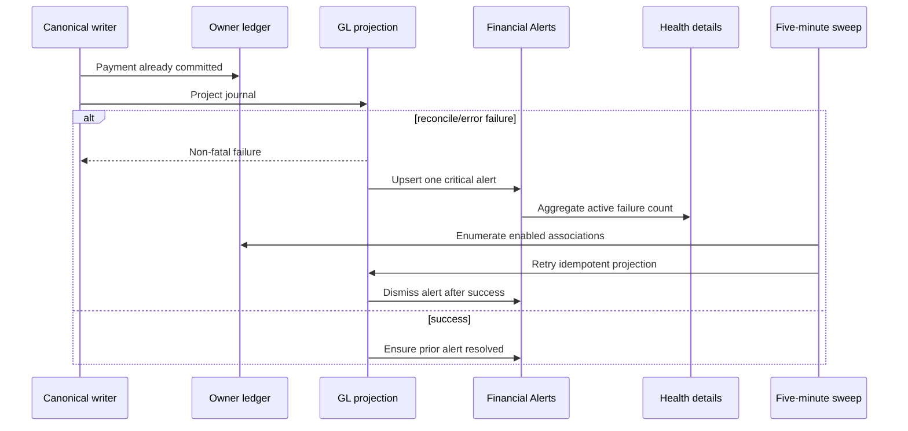

#### Lifecycle

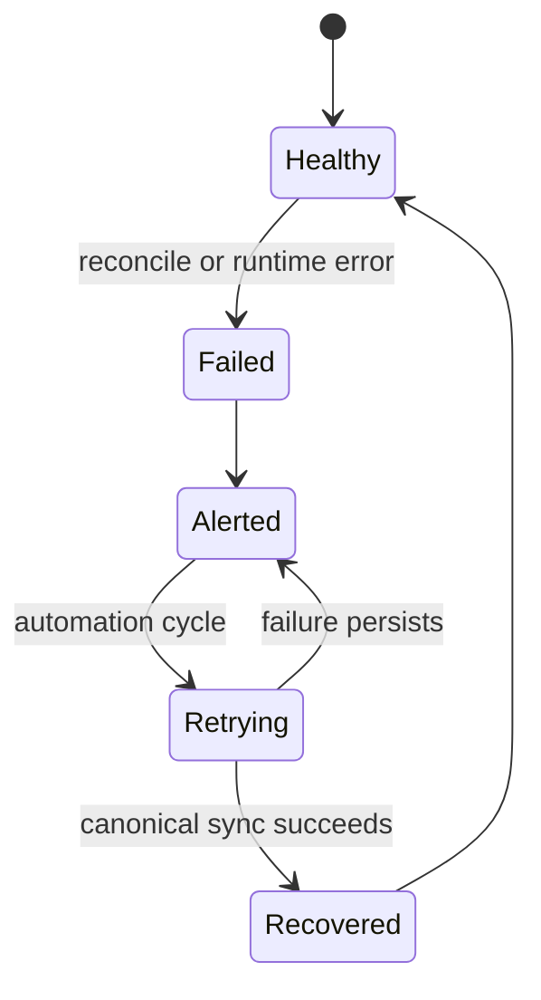

#### Data lineage

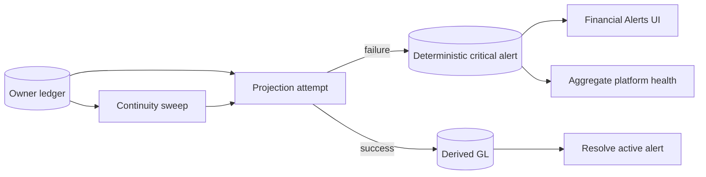

#### Continuity matrix

| Dimension | Result | Evidence | Gap/notes |
|---|---|---|---|
| Entry | Pass | EV-PAY-007 | Failure branches covered. |
| Identity/scope | Pass | EV-PAY-008 | Association-scoped alert and sweep. |
| Validation | Pass | EV-PAY-007 | Reconcile gate remains blocking. |
| Orchestration/state | Pass | EV-PAY-007, EV-PAY-008 | Failure, retry, recovery modeled. |
| Data/projection | Pass | EV-PAY-007 | Payment truth is preserved. |
| Async/idempotency | Pass | EV-PAY-008 | Repeated sweep and deterministic alert. |
| Provider | Not applicable | EV-PAY-008 | Recovery derives from local authority. |
| Notifications | Pass | EV-PAY-009 | Critical in-app alert and health warning implemented/tested. |
| User-visible outcome | Gated | EV-PAY-010 | Deployed Financial Alerts/health visibility pending. |
| Audit/operations | Pass | EV-PAY-008, EV-PAY-009 | Aggregate counters and safe alert. |
| Privacy/retention | Pass | EV-PAY-009 | Alert excludes owner/unit/payment/amount/provider data. |

### WF-PAY-004 — Refund or chargeback reversal reaches accounting

- Actor/beneficiary: Stripe/YCM automation and association financial operator.
- Trigger/entry: signed successful refund or lost-dispute event.
- Preconditions: original recorded Stripe charge exists.
- Terminal outcome: one positive owner-ledger adjustment restores the amount owed; the derived adjustment journal is projected; replay does not duplicate either.
- Invariants: reversal inherits original association/unit/person scope; non-succeeded refunds and non-lost disputes do not reverse; fee and principal remain separately idempotent; GL remains balanced.
- Status and rationale: `gated` until staged/deployed aggregate validation; no live refund/dispute is authorized.

#### Sequence

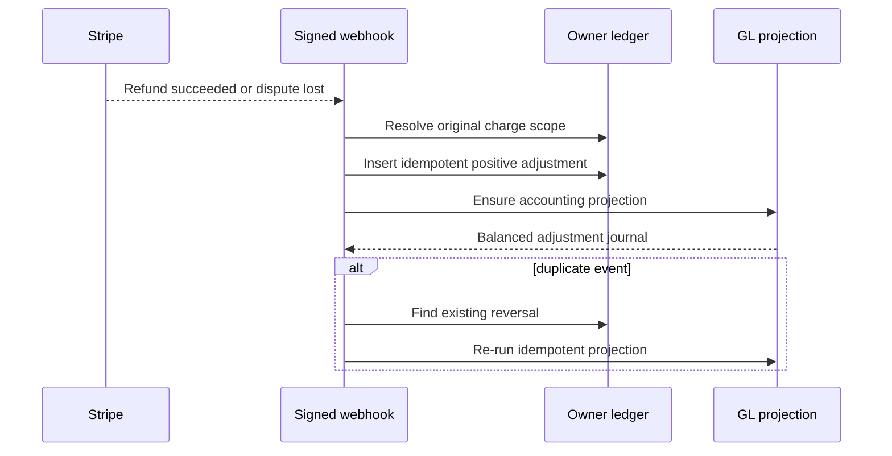

#### Lifecycle

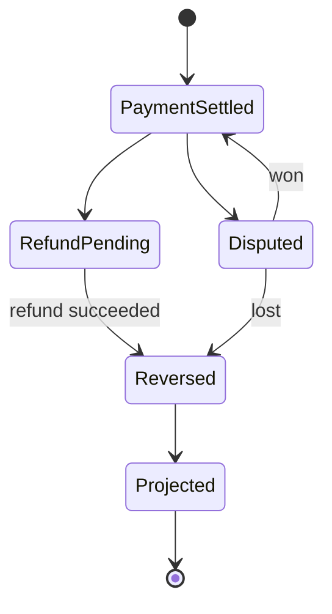

#### Data lineage

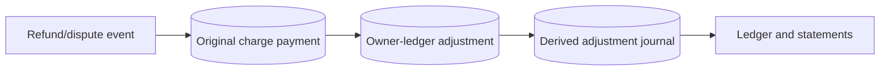

#### Continuity matrix

| Dimension | Result | Evidence | Gap/notes |
|---|---|---|---|
| Entry | Pass | EV-PAY-011 | Signed route behavior covered. |
| Identity/scope | Pass | EV-PAY-011 | Scope inherited from original charge. |
| Validation | Pass | EV-PAY-011 | Refund/dispute state guards. |
| Orchestration/state | Pass | EV-PAY-011 | Reversal immediately calls projection. |
| Data/projection | Pass | EV-PAY-011 | Positive adjustment and derived journal path. |
| Async/idempotency | Pass | EV-PAY-011 | Exact reversal identifiers deduplicate replay. |
| Provider | Pass | EV-PAY-011 | Synthetic Stripe event variants covered. |
| Notifications | Not applicable | EV-PAY-012 | This workflow boundary is the accounting projection, not owner refund policy messaging. |
| User-visible outcome | Gated | EV-PAY-012 | Live ledger/statement display pending. |
| Audit/operations | Pass | EV-PAY-011 | Source and stable identifiers retained. |
| Privacy/retention | Pass | EV-PAY-011 | No new private payload persistence. |

## Diagnostics and RCA

| RCA ID | Workflow | Symptom | First divergence | Root cause | Repair | Regression | Status |
|---|---|---|---|---|---|---|---|
| RCA-PAY-GL-001 | WF-PAY-001 | One successful $330 payment had owner-ledger truth but no GL journal; aggregate GL AR drift was $330. | The platform Connect `charge.succeeded` path returned after owner-ledger persistence without invoking GL sync. | GL projection was caller-owned; two callers remembered it, but the platform Connect path did not. Failures only logged and had no durable retry/alert. | Canonical writer owns projection; exact replay heals; deterministic critical alert; five-minute sweep; platform receipt fallback. | 88 targeted route/service tests pass. | Repair complete in branch; live correction gated |
| RCA-PAY-GL-002 | WF-PAY-003 | Historical canonical-shape drift blocked additive sync for 13 assessment journals. | Runtime canonical-shape comparison found unexpected persisted legs. | A prior posting-policy change added the new assessment-income leg without retiring obsolete persisted legs. | Existing protected canonical-repair script plus separate snapshot/approval gate; runtime now alerts and retries instead of silently drifting. | Canonical-shape suite and repair assertions are release gates. | Production repair not yet executed |

## Repairs and validation

| Change | Invariant restored | Tests | Deployment | Live evidence | Rollback |
|---|---|---|---|---|---|
| Projection owned by canonical payment writer | Every new/cross-path payment invokes accounting | Ledger identity and payment transaction suites | Pending | Pending | Revert application commit; owner ledger remains authority |
| Exact replay and reversal projection | Replay heals without duplicate economic event | Stripe reconciliation suite | Pending | Pending | Revert application commit |
| Deterministic critical alert and health aggregate | Projection failure is visible without private payload | GL runtime and alert suites | Pending | Pending | Revert alert code; no schema change |
| Five-minute continuity sweep | Crash/legacy gap recovers without provider replay | Sweep suite | Pending | Pending | Remove sweep invocation |
| Platform Connect receipt fallback | Owner receipt is not dependent on one webhook topology | Stripe Connect route suite | Pending | Pending | Revert route addition; receipt service remains intact |

## Residual risks, gates, and watchlist

| Item | Type | Impact | Exact unblock/action | Owner | Due/trigger |
|---|---|---|---|---|---|
| Repaired code not deployed | Gate | No live certification | Pass full CI, stage, release, and read-only production smoke | YCM GM | Before certification |
| One missing payment journal plus 13 noncanonical assessment journals | Historical derived-data repair | Current derived statements remain unreliable | Snapshot, run gated canonical repair, assert zero missing/unbalanced/drift | YCM GM under existing release authority | After application release |
| No new live payment authorized | Gate | Provider-to-live proof remains bounded | Use read-only smoke by default; obtain separate founder authority for live money | William | Only if live-money validation is requested |
| Refund/dispute owner messaging policy | Excluded | Does not block accounting projection certification | Audit separately before expanding refund/dispute customer communications | YCM product owner | Before broader policy release |

## Evidence index

| Evidence ID | Layer | Claim | Locator | Environment/release | Observed |
|---|---|---|---|---|---|
| EV-PAY-001 | Code | Canonical payment writer owns immediate GL projection. | `server/services/ledger-payment-identity.ts#postPaymentLedgerEntry` | Branch | 2026-07-24T17:33:12Z |
| EV-PAY-002 | Test | Canonical identity prevents duplicate owner credits and replays projection. | `ledger-payment-identity.test.ts` | Vitest local isolated | 2026-07-24T17:34:24Z |
| EV-PAY-003 | Test | Signed Connect success updates transaction, posts ledger, and invokes receipt fallback. | `stripe-connect.test.ts` | Vitest local isolated | 2026-07-24T17:34:24Z |
| EV-PAY-004 | Data | Read-only production RCA found 94 expected journals, 93 persisted, one missing $330 journal, and $330 AR drift. | Aggregate production GL canonical audit; private rows omitted | Production read-only | 2026-07-24 |
| EV-PAY-005 | Test | Exact, cross-path, concurrent, and payout replays remain exactly once and re-project. | `stripe-reconciliation.test.ts`; `ledger-payment-identity.test.ts` | Vitest local isolated | 2026-07-24T17:34:24Z |
| EV-PAY-006 | Code | Receipt service uses a sent marker to avoid duplicate owner receipts. | `server/services/payment-receipt-email.ts#sendPaymentReceiptEmail` | Branch | 2026-07-24T17:33:12Z |
| EV-PAY-007 | Test | Reconcile/runtime failures are non-fatal to payment truth and persist a critical alert. | `gl-runtime-sync.test.ts` | Vitest local isolated | 2026-07-24T17:34:24Z |
| EV-PAY-008 | Test | Sweep isolates associations and retries enabled cohorts without aborting peers. | `gl-projection-sweep.test.ts` | Vitest local isolated | 2026-07-24T17:34:24Z |
| EV-PAY-009 | Test | Deterministic alert contains no owner/unit/payment/amount/provider identifiers and resolves only on success. | `gl-projection-alerts.test.ts` | Vitest local isolated | 2026-07-24T17:34:24Z |
| EV-PAY-010 | Code | Admin health exposes only an aggregate active-failure count and Financial Alerts provides scoped visibility. | `server/routes.ts#/api/health/details`; `server/routes.ts#/api/financial/alerts` | Branch | 2026-07-24T17:33:12Z |
| EV-PAY-011 | Test | Refund and lost-dispute reversals are scoped, state-guarded, idempotent, and re-project accounting. | `stripe-reconciliation.test.ts`; `stripe-connect.test.ts` | Vitest local isolated | 2026-07-24T17:34:24Z |
| EV-PAY-012 | Code | Derived ledger and statement reads include reversal adjustments after projection. | `server/services/gl/posting.ts#postOwnerLedgerEntry`; statement service | Branch | 2026-07-24T17:33:12Z |
| EV-PAY-013 | Test | The settled-payment alert path minimizes private data and resolves only after recovery. | `gl-projection-alerts.test.ts` | Vitest local isolated | 2026-07-24T17:34:24Z |

## Completion-gate result

- [x] Actor and capability inventories reconcile.
- [x] Every workflow has a trace, diagrams, status, and evidence.
- [x] Every applicable continuity dimension is evaluated.
- [x] Every failure has an RCA or bounded diagnostic gap.
- [x] Repairs have regression evidence.
- [ ] Critical postconditions are authoritative after deployment and historical repair.
- [x] In-scope notifications cover generation, recipient, retry, and visible failure.
- [x] Manifest validator passes with zero errors and zero warnings.
- [x] Gates and risks have exact owners/actions.
- [ ] Published artifacts were opened and interaction-tested.
